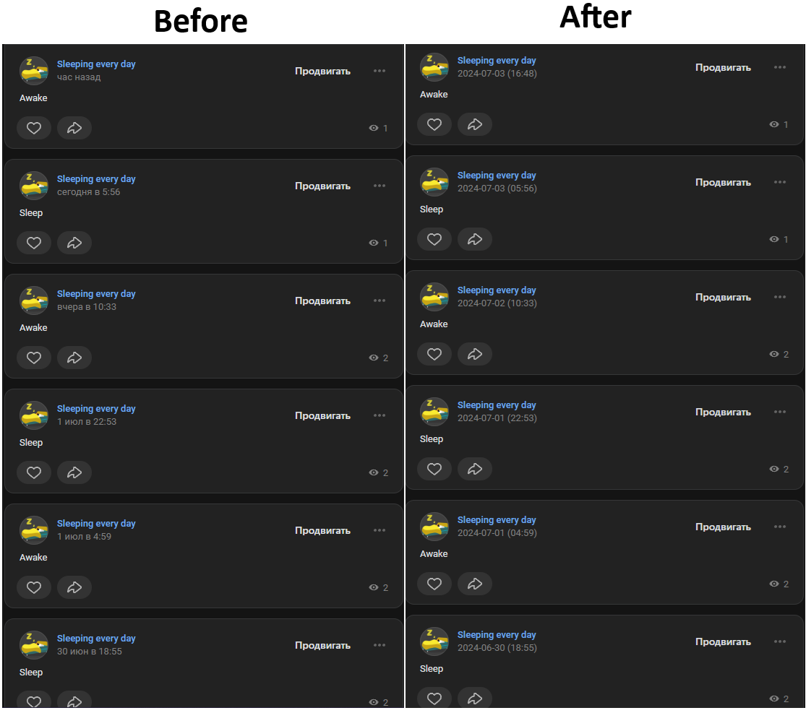

# VK Absolute Date Fix

This userscript changes relative time to absolute time in wall posts on VK.com. Instead of seeing "сегодня в 5:56" or "вчера в 10:33", you'll see a precise date and time like "2024-07-03 05:56".

(RU) Этот скрипт изменяет относительное время на абсолютное в записях на стене VK.com. Вместо "сегодня в 5:56" или "вчера в 10:33" вы увидите точную дату и время, например, "2024-07-03 05:56". 

## Installation

1. **Install Tampermonkey:**
   - Go to the [Tampermonkey website](https://www.tampermonkey.net/scripts.php) and install Tampermonkey for your browser.

2. **Install the Script:**
   - Click on the following link to install the script directly: [Install VK Absolute Date Fix](https://github.com/dphdmn/VKabsolutedate/raw/main/VK%20absolute%20time%20fix-2024-07-03.user.js).

## How it Works

This script automatically converts relative time indicators in VK.com posts into absolute dates and times in the format `YYYY-MM-DD (HH:mm)`.

## Example

## How to Use

Once you have installed Tampermonkey and added the script, it will automatically run on VK.com and replace the relative times with absolute ones in wall posts.

## Notes

- The script handles various Russian date formats, including "сегодня", "вчера", and specific dates like "1 июл в 22:53".
- If you encounter any issues or have suggestions, feel free to open an issue on the GitHub repository.
- This script only works if you use russian language at VK.com. May change later, but it is unlikely.

## License

This project is licensed under the MIT License.
